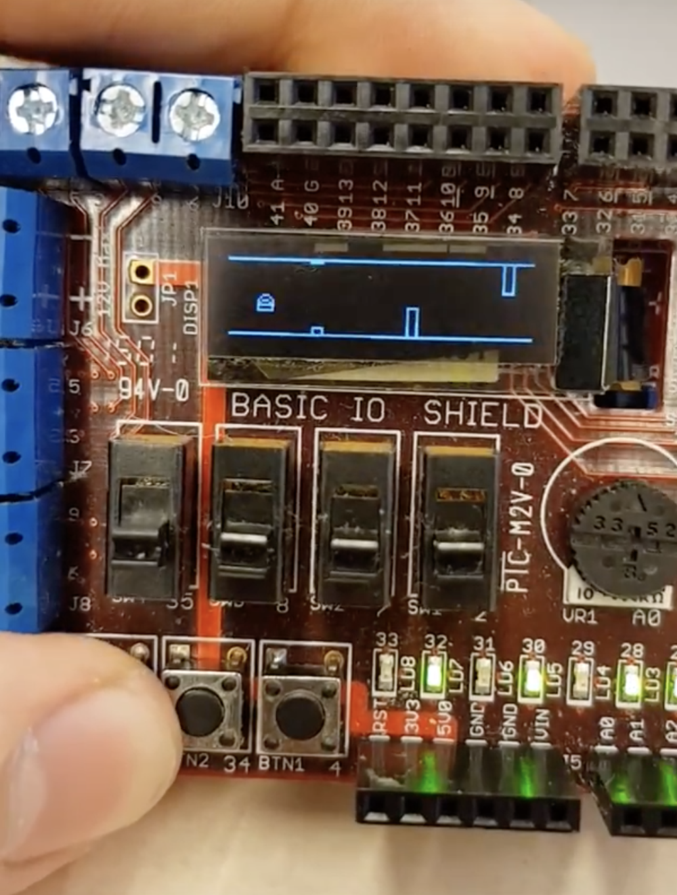

# A 2D Flappy Bird game 

Watch a demo of the final project here: https://drive.google.com/drive/u/0/folders/0B_TssqdpJ9qGZ3dVb3VVRTRCQkU

Normal Round of the game

## Written in C and Assembler directly on a PIC32-processor

Sorted high score list directly in memory

## Uses moving graphics on both the X- and Y-axis

"Moving Obstacles"-mode activated on button-press

## Conditional logic and interactive buttons to control the game

Death animation
